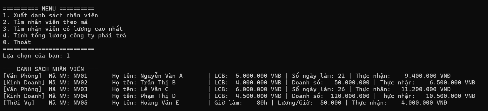
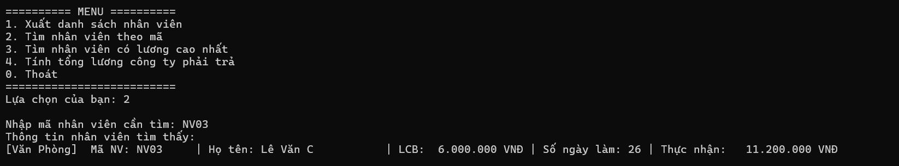
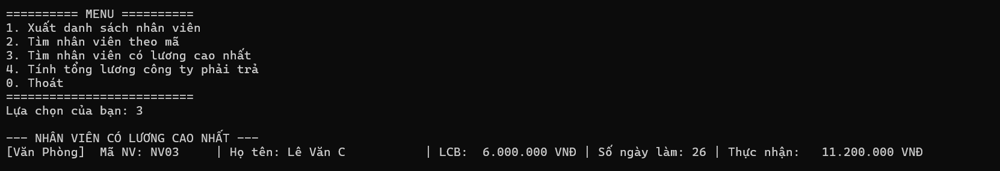
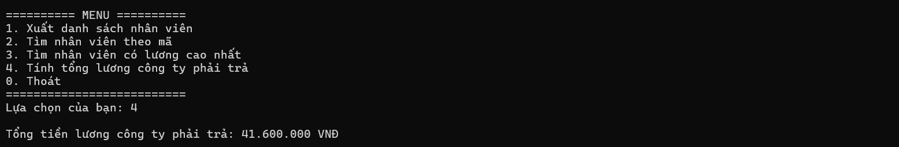
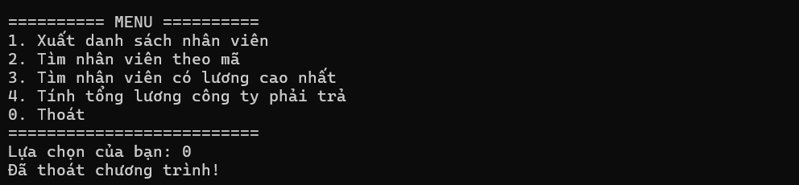

# BTLOP - 16.09.2026 - Quản Lý Nhân Viên - Ứng dụng Console C#

## Thông tin sinh viên
- Họ tên: Lê Thị Kim Loan
- MSSV: 49.01.103.045
- Lớp: 49.01.SPTIN.A

## Mô tả
Ứng dụng Console C# quản lý nhân viên, áp dụng các kiến thức về Class, Property, Constructor, Encapsulation, Kế thừa và Đa hình.
Chương trình quản lý danh sách gồm nhiều loại nhân viên khác nhau (văn phòng, kinh doanh, thời vụ), mỗi loại có công thức tính lương riêng. Chương trình cung cấp các chức năng xuất danh sách, tra cứu và thống kê trên toàn bộ danh sách bằng cách áp dụng triệt để tính đa hình mà không cần dùng lệnh `if`/`switch` để kiểm tra kiểu nhân viên.

## Công nghệ sử dụng
- Ngôn ngữ: C# (.NET)
- Loại ứng dụng: Console Application
- Cấu trúc dữ liệu: `List<Nhanvien>`

## Các lớp trong chương trình

| Lớp | Quan hệ | Công thức tính lương |
|-----|---------|----------------------|
| `Nhanvien` | Lớp cơ sở (Lớp cha) | Lương cơ bản |
| `Nhanvienvanphong` | Kế thừa `Nhanvien` | Lương cơ bản + Số ngày làm việc × 200.000 |
| `Nhanvienkinhdoanh` | Kế thừa `Nhanvien` | Lương cơ bản + 5% × Doanh số |
| `Nhanvienthoivu` | Kế thừa `Nhanvien` | Số giờ làm × Lương theo giờ |

## Chức năng chính

### Danh sách nhân viên mặc định
Khi khởi động, chương trình tự động tạo sẵn danh sách mẫu gồm 5 nhân viên thuộc cả 3 loại (`Nhanvienvanphong`, `Nhanvienkinhdoanh`, `Nhanvienthoivu`) để thực thi ngay các chức năng menu:

1. **NV01** - Nguyễn Văn A - Lương cơ bản: 5.000.000, Ngày làm: 22 (Văn phòng)
2. **NV02** - Trần Thị B - Lương cơ bản: 4.000.000, Doanh số: 50.000.000 (Kinh doanh)
3. **NV03** - Lê Văn C - Lương cơ bản: 6.000.000, Ngày làm: 26 (Văn phòng)
4. **NV04** - Phạm Thị D - Lương cơ bản: 4.500.000, Doanh số: 120.000.000 (Kinh doanh)
5. **NV05** - Hoàng Văn E - Giờ làm: 80h, Lương/Giờ: 50.000 (Thời vụ)

### Menu chức năng

========== MENU ==========

Xuất danh sách nhân viên

Tìm nhân viên theo mã

Tìm nhân viên có lương cao nhất

Tính tổng lương công ty phải trả

Thoát
==========================

#### 1. Xuất danh sách nhân viên
Duyệt qua danh sách `List<Nhanvien>` và gọi phương thức `HienThiThongTin()`. Tính đa hình giúp chương trình tự động gọi đúng phương thức `HienThiThongTin()` của từng lớp con tương ứng để in ra chi tiết thông tin và thực nhận của nhân viên đó.

#### 2. Tìm nhân viên theo mã
Nhập mã nhân viên từ bàn phím để tra cứu (không phân biệt chữ hoa/thường). Khi tìm thấy, chương trình gọi `HienThiThongTin()` của nhân viên đó. Nếu không tìm thấy, thông báo sẽ hiển thị cho người dùng.

#### 3. Tìm nhân viên có lương cao nhất
So sánh lương giữa các nhân viên trong danh sách bằng cách gọi hàm `nv.TinhLuong()`. Phương thức `TinhLuong()` được override ở từng lớp con nên thuật toán tìm Max hoạt động chung cho mọi loại nhân viên mà không cần kiểm tra kiểu dữ liệu.

#### 4. Tính tổng lương công ty phải trả
Dùng vòng lặp cộng dồn kết quả trả về từ `nv.TinhLuong()` của từng nhân viên trong danh sách.

#### 0. Thoát chương trình
Thoát khỏi vòng lặp và kết thúc chương trình console.

## Cách chạy
1. Mở file solution `16092026.sln` bằng Visual Studio.
2. Nhấn `F5` hoặc `Ctrl + F5` để chạy chương trình.
3. Nhập các số từ `1` đến `4` để chọn chức năng trên Menu, nhập `0` để thoát.