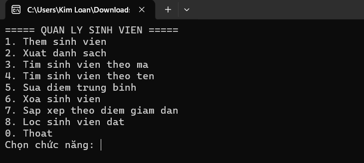
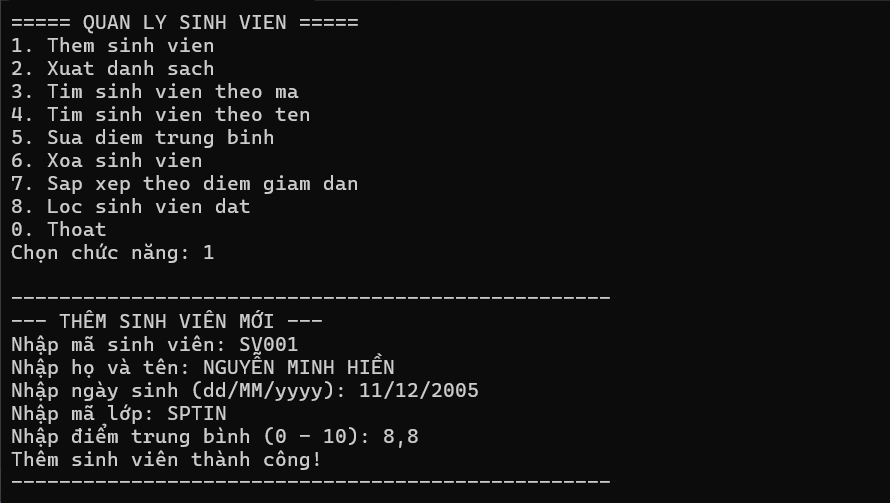
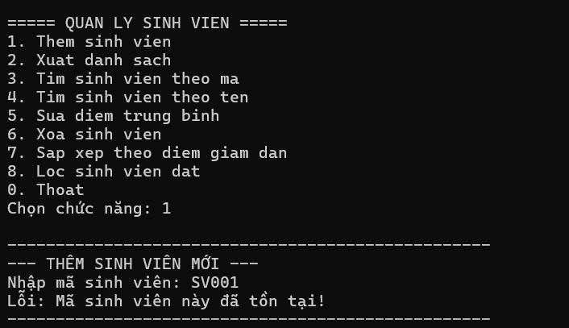
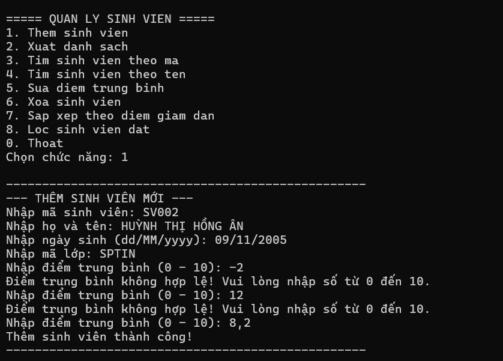
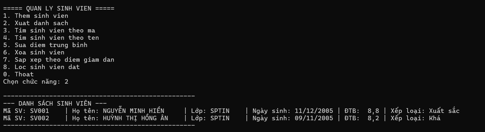
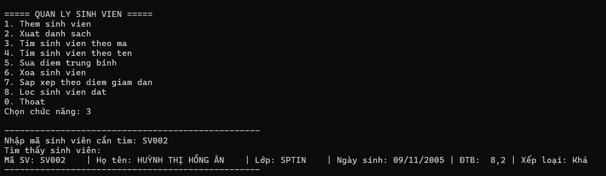
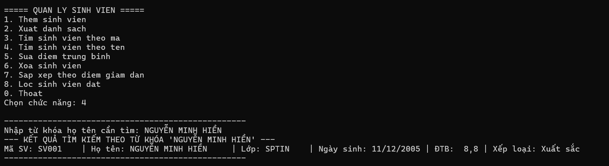
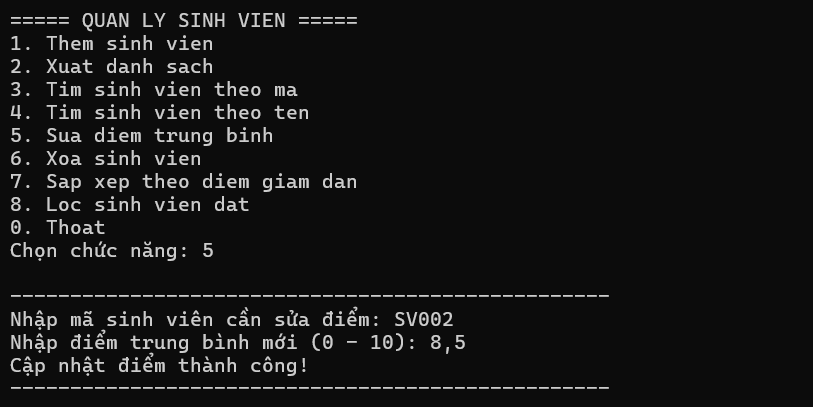
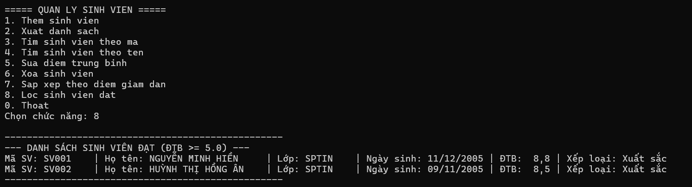

# Lab 03 - Quản lý sinh viên bằng Console

## Thông tin sinh viên

- Họ tên: Lê Thị Kim Loan
- MSSV: 49.01.103.045
- Lớp: 49.01.SPTINA

## Mô tả

Chương trình Console viết bằng C# theo hướng đối tượng, cho phép quản lý danh sách sinh viên (`List<SinhVien>`) thông qua menu[cite: 1, 2]. Dữ liệu được lưu tạm trong bộ nhớ khi chương trình đang chạy[cite: 1, 2].

Chương trình vận dụng:

- Class, object, property và constructor[cite: 1, 2].
- Kế thừa: `SinhVien` kế thừa từ `Nguoi`[cite: 1, 2].
- `List<SinhVien>` để quản lý danh sách, được đóng gói trong lớp `QuanLySinhVien`, `Program`/`Main` không thao tác trực tiếp lên danh sách[cite: 1, 2].
- LINQ cơ bản để tìm kiếm, lọc và sắp xếp dữ liệu[cite: 1, 2].
- Validation & Exception Handling để đảm bảo chương trình không bị dừng bất thường khi nhập sai dữ liệu[cite: 1, 2].

## Cấu trúc thư mục

```text
Lab03_QuanLySinhVienOOP/
├── Nguoi.cs             # Class cha Nguoi
├── SinhVien.cs          # Class SinhVien kế thừa Nguoi
├── QuanLySinhVien.cs    # Service quản lý danh sách sinh viên
├── Program.cs           # Giao diện Console & Menu điều khiển
└── README.md            # Tài liệu hướng dẫn
```[cite: 1, 2]

## Chức năng

- **Thêm sinh viên**: Nhập thông tin sinh viên mới (kiểm tra mã sinh viên không trùng, điểm từ 0 - 10)[cite: 1, 2].
- **Xuất danh sách**: In danh sách sinh viên gồm mã, họ tên, lớp, điểm trung bình và xếp loại[cite: 1, 2].
- **Tìm sinh viên theo mã**: Tìm và in thông tin sinh viên theo mã chính xác[cite: 1, 2].
- **Tìm sinh viên theo tên**: Tìm kiếm chứa từ khóa họ tên bằng LINQ[cite: 1, 2].
- **Sửa điểm trung bình**: Cập nhật điểm trung bình mới theo mã sinh viên[cite: 1, 2].
- **Xóa sinh viên**: Xóa sinh viên khỏi danh sách theo mã[cite: 1, 2].
- **Sắp xếp theo điểm giảm dần**: Sắp xếp danh sách bằng LINQ `OrderByDescending`[cite: 1, 2].
- **Lọc sinh viên đạt**: In các sinh viên có điểm trung bình từ 5.0 trở lên bằng LINQ `Where`[cite: 1, 2].
- **Thoát**: Kết thúc chương trình[cite: 1, 2].

## Công nghệ sử dụng

- Ngôn ngữ: C#[cite: 1, 2]
- Nền tảng: .NET 8 (Console App)[cite: 1, 2]
- IDE: Visual Studio[cite: 1, 2]

## Cách chạy

1. Mở file `Lab03_QuanLySinhVienOOP.csproj` hoặc `.sln` bằng Visual Studio[cite: 2].
2. Build solution (`Ctrl` + `Shift` + `B`)[cite: 2].
3. Chạy project (`F5` hoặc `Ctrl` + `F5`)[cite: 2].

## Hình ảnh minh họa

*(Thêm hình chụp màn hình vào thư mục `screenshots/` nếu cần)*

### Menu chính
[cite: 2]

### Thêm sinh viên thành công
[cite: 2]

### Thêm sinh viên với mã đã tồn tại
[cite: 2]

### Kiểm tra dữ liệu điểm nhập vào (âm, lớn hơn 10, hợp lệ)
[cite: 2]

### Xuất danh sách sinh viên
[cite: 2]

### Tìm sinh viên theo mã
[cite: 2]

### Tìm sinh viên theo tên
[cite: 2]

### Sửa điểm trung bình
[cite: 2]

### Sắp xếp theo điểm giảm dần
[cite: 2]

### Lọc sinh viên đạt (điểm >= 5)
[cite: 2]