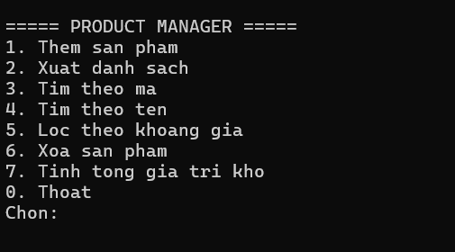
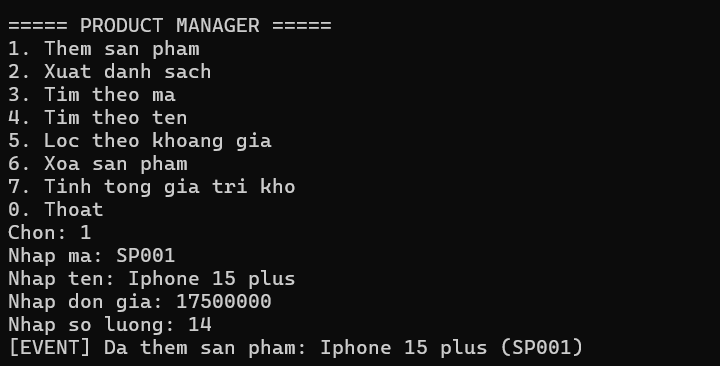
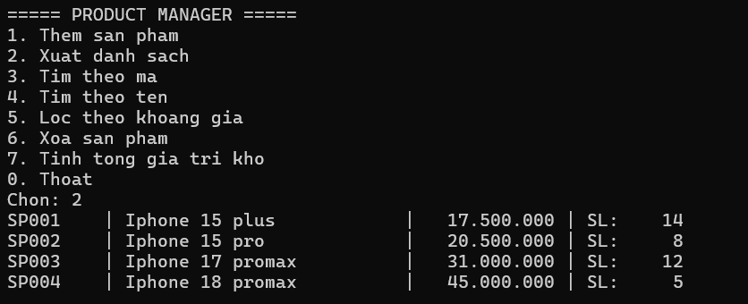
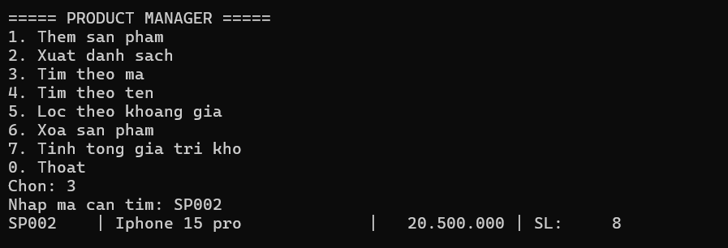
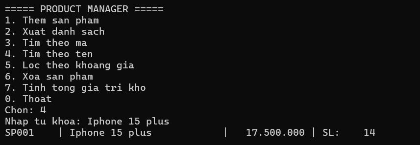
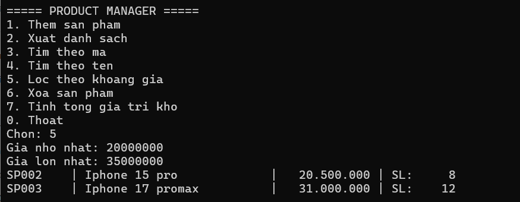
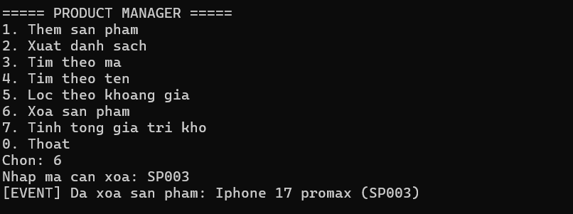
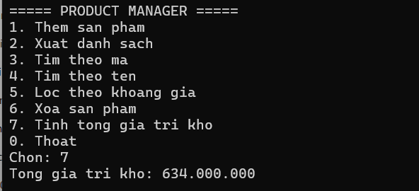
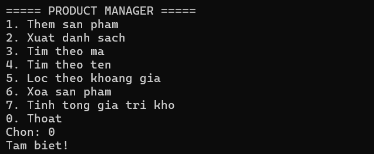

# Lab 04 - Quản lý sản phẩm bằng Console App (C#)

Bài thực hành **Buổi 4 - COMP1019 Lập trình trên Windows**: Exception, Delegate/Event, Func/Action và Generic trong C#.

## Thông tin sinh viên

- Họ tên: Lê Thị Kim Loan
- MSSV: 49.01.103.045
- Lớp: 49.01.SPTINA

## Mô tả

Ứng dụng Console quản lý sản phẩm. Dữ liệu được lưu trong bộ nhớ bằng `Repository<T>` (generic class). Chương trình xử lý lỗi nhập liệu, mã sản phẩm trùng và sản phẩm không tồn tại bằng exception phù hợp, đồng thời phát event khi thêm hoặc xóa sản phẩm thành công.

## Công nghệ sử dụng

- C# / .NET 8
- Console App
- Visual Studio 2022

## Chức năng

| Lựa chọn | Chức năng | Mô tả |
|:-:|---|---|
| 1 | Thêm sản phẩm | Nhập mã, tên, đơn giá, số lượng. Mã không được rỗng và không được trùng. |
| 2 | Xuất danh sách | In toàn bộ sản phẩm. Nếu danh sách rỗng thì thông báo phù hợp. |
| 3 | Tìm theo mã | Nhập mã sản phẩm, in thông tin nếu tìm thấy (không phân biệt hoa thường). |
| 4 | Tìm theo tên | Nhập từ khóa, in các sản phẩm có tên chứa từ khóa. |
| 5 | Lọc theo khoảng giá | Nhập giá nhỏ nhất và lớn nhất, lọc bằng `Func<Product, bool>`. |
| 6 | Xóa sản phẩm | Nhập mã sản phẩm, nếu tồn tại thì xóa và phát event. |
| 7 | Tính tổng giá trị kho | Tổng = đơn giá × số lượng của tất cả sản phẩm. |
| 0 | Thoát | Kết thúc chương trình. |

## Kiến thức áp dụng

| Nội dung | Vị trí trong code |
|---|---|
| Interface làm ràng buộc generic | `IEntity` (`string Id { get; }`) |
| Kiểm tra dữ liệu trong property | `Product`: `Price`, `Quantity` không được âm; mã, tên không được rỗng |
| Exception tự tạo | `DuplicateProductException`, `ProductNotFoundException` |
| Generic class có constraint | `Repository<T> where T : IEntity` |
| `Func<T, bool>` | `Repository<T>.Find`, `ProductService.Filter`, `SearchByName`, `FilterByPrice` |
| Event (`Action<Product>`) | `ProductService.ProductAdded`, `ProductService.ProductRemoved` |
| Xử lý lỗi, không dừng đột ngột | `try-catch` trong vòng lặp menu, `TryParse` khi nhập số |

## Cấu trúc thư mục

```
ProductManager/
├── ProductManager.sln
├── ProductManager/
│   ├── Models/
│   │   ├── IEntity.cs
│   │   └── Product.cs
│   ├── Exceptions/
│   │   ├── DuplicateProductException.cs
│   │   └── ProductNotFoundException.cs
│   ├── Repositories/
│   │   └── Repository.cs
│   ├── Services/
│   │   └── ProductService.cs
│   └── Program.cs
├── docs/
│   └── screenshots/
├── README.md
└── .gitignore
```

## Cách chạy

**Cách 1: Visual Studio**

1. Mở file `ProductManager.sln` bằng Visual Studio 2022.
2. Build solution (`Ctrl + Shift + B`).
3. Chạy chương trình bằng `Ctrl + F5`.

**Cách 2: Dòng lệnh**

```bash
cd ProductManager
dotnet run
```

Yêu cầu: đã cài .NET SDK 8.0 trở lên.

## Hình ảnh minh họa

### Menu chính


### 1. Thêm sản phẩm (có event thông báo)


### 2. Xuất danh sách


### 3. Tìm theo mã


### 4. Tìm theo tên


### 5. Lọc theo khoảng giá


### 6. Xóa sản phẩm (có event thông báo)


### 7. Tính tổng giá trị kho


### 0. Thoát
