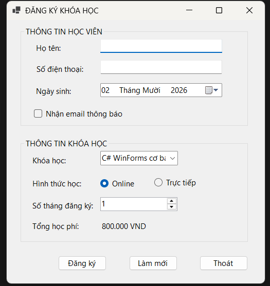
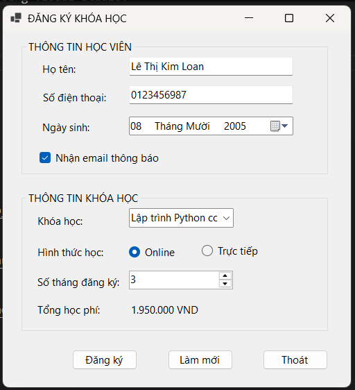
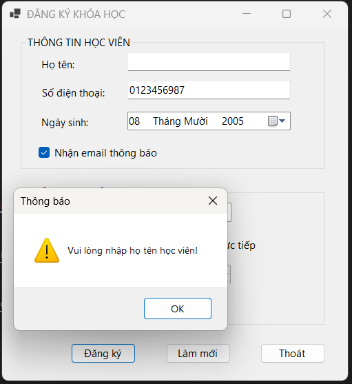
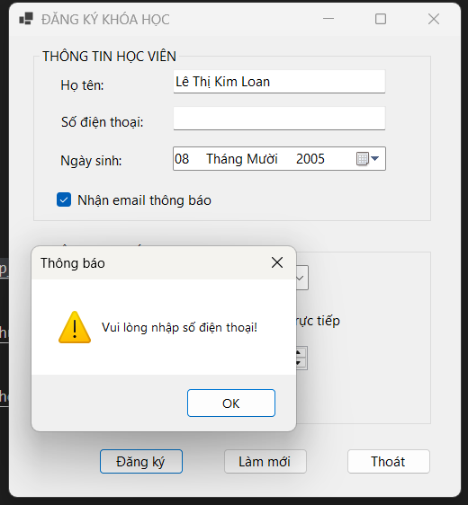
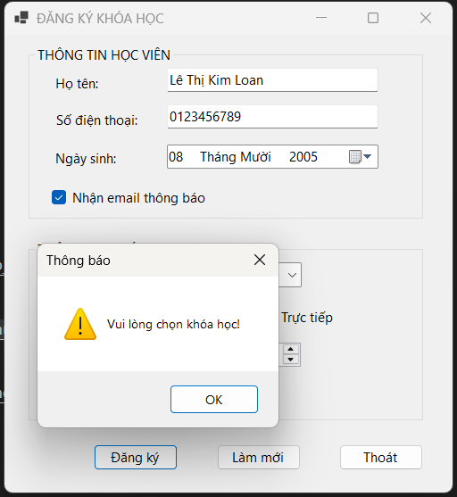
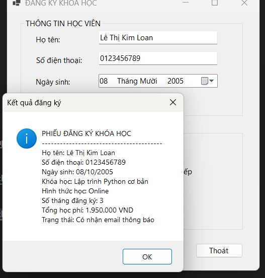
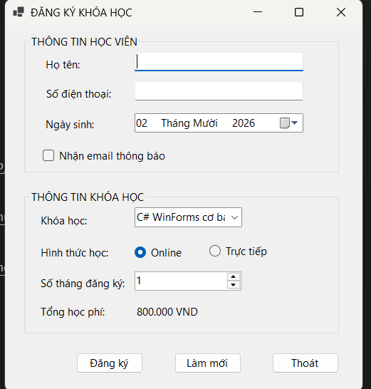
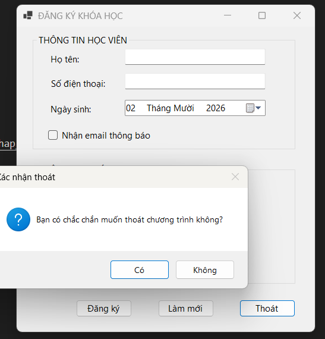

# Lab 05 - Ứng dụng đăng ký khóa học (CourseRegistrationApp)
## Thông tin sinh viên
- Họ tên: Lê Thị Kim Loan
- MSSV: 49.01.103.045
- Lớp: 49.01.SPTIN.A
## Mô tả
Ứng dụng WinForms cho phép đăng ký khóa học gồm: thông tin học viên (họ tên, số điện thoại, ngày sinh, nhận email) và thông tin khóa học (khóa học, hình thức học, số tháng đăng ký). Ứng dụng tự động tính tổng học phí và hiển thị phiếu đăng ký bằng MessageBox. Dữ liệu chỉ xử lý trên Form, không lưu cơ sở dữ liệu.

## Chức năng
- Nhập họ tên, số điện thoại, chọn ngày sinh.
- Chọn nhận email thông báo (CheckBox).
- Chọn khóa học từ danh sách có sẵn (ComboBox).
- Chọn hình thức học: Online / Trực tiếp (RadioButton).
- Chọn số tháng đăng ký từ 1 đến 12 (NumericUpDown).
- Tự động tính lại tổng học phí khi thay đổi khóa học hoặc số tháng.
- Kiểm tra dữ liệu nhập (họ tên, số điện thoại, khóa học) trước khi đăng ký.
- Hiển thị phiếu đăng ký bằng MessageBox.
- Làm mới dữ liệu trên form.
- Thoát chương trình có hộp thoại xác nhận.

## Dữ liệu khóa học

| Khóa học | Học phí/tháng |
|---|---|
| C# WinForms cơ bản | 800.000 VNĐ |
| SQL Server cơ bản | 700.000 VNĐ |
| Web Frontend cơ bản | 750.000 VNĐ |
| Lập trình Python cơ bản | 650.000 VNĐ |

**Công thức:** Tổng học phí = Học phí một tháng × Số tháng đăng ký.

## Danh sách control chính

| Nhóm | Control | Tên control | Ghi chú |
|---|---|---|---|
| Thông tin học viên | TextBox | `txtHoTen` | Nhập họ tên học viên |
| Thông tin học viên | TextBox | `txtSoDienThoai` | Nhập số điện thoại |
| Thông tin học viên | DateTimePicker | `dtpNgaySinh` | Chọn ngày sinh |
| Thông tin học viên | CheckBox | `chkNhanEmail` | Nhận email thông báo |
| Thông tin khóa học | ComboBox | `cboKhoaHoc` | Chọn khóa học |
| Thông tin khóa học | RadioButton | `radOnline` | Hình thức online |
| Thông tin khóa học | RadioButton | `radOffline` | Hình thức trực tiếp |
| Thông tin khóa học | NumericUpDown | `numSoThang` | Số tháng đăng ký |
| Thông tin khóa học | Label | `lblTongTien` | Hiển thị tổng học phí |
| Nút lệnh | Button | `btnDangKy` | Xử lý đăng ký |
| Nút lệnh | Button | `btnLamMoi` | Xóa dữ liệu |
| Nút lệnh | Button | `btnThoat` | Thoát chương trình |

## Công nghệ sử dụng
- C# WinForms
- .NET 8

## Cách chạy
1. Mở file `Lab05_CourseRegistrationApp/CourseRegistrationApp.sln` bằng Visual Studio.
2. Build solution.
3. Nhấn F5 để chạy chương trình.

## Hình ảnh minh họa

### Màn hình chính (khi Form Load)

### Tổng học phí thay đổi khi chọn khóa học hoặc số tháng

### Cảnh báo khi chưa nhập họ tên

### Cảnh báo khi chưa nhập số điện thoại

### Cảnh báo khi chưa chọn khóa học

### Hiển thị phiếu đăng ký

### Làm mới dữ liệu

### Xác nhận thoát chương trình

